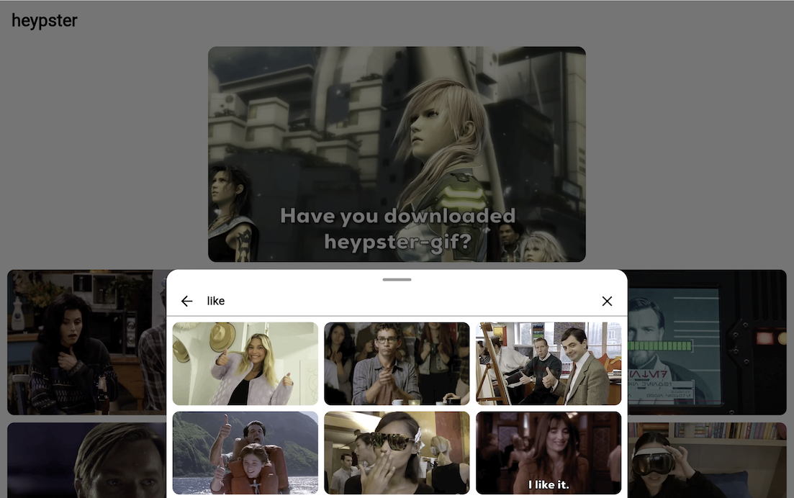

# heypster_flutter_sdk

The official Flutter SDK for [heypster](https://heypster.com), a privacy-first,
GDPR-compliant GIF platform for businesses.

Works on **all Flutter platforms**: iOS, Android, Web, macOS, Windows, Linux.



## Quick Start

### 1. Install

```yaml
dependencies:
  heypster_flutter_sdk:
    git:
      url: https://gitlab.com/heypster/heypster-flutter-sdk.git
```

### 2. Configure

```dart
import 'package:heypster_flutter_sdk/heypster_flutter_sdk.dart';

void main() {
  HeypsterFlutterSDK.configure(apiKey: 'YOUR_API_KEY');
  runApp(const MyApp());
}
```

### 3. Register Localizations

Add `HeypsterLocalizations.delegate` to your app's existing
localization delegates so the SDK's UI is displayed in the user's
language:

```dart
MaterialApp(
  localizationsDelegates: [
    ...GlobalMaterialLocalizations.delegates,
    HeypsterLocalizations.delegate,   // <-- add this
    // ... your other delegates
  ],
  supportedLocales: [
    ...HeypsterLocalizations.supportedLocales,
    // ... your other locales
  ],
  // ...
)
```

Supported languages: English, French, German, Spanish, Italian,
Portuguese, Dutch, Danish, Swedish, Norwegian, Finnish.

### 4. Show the GIF Picker

```dart
class MyScreen extends StatefulWidget implements HeypsterMediaSelectionListener {
  @override
  void onMediaSelect(HeypsterMedia media) {
    // Handle selected GIF
  }

  @override
  void onDismiss() {
    // Dialog dismissed
  }
}

// Register listener
HeypsterDialog.instance.addListener(this);

// Show picker
HeypsterDialog.instance.show(context: context);
```

### 5. Display a GIF

```dart
HeypsterMediaView(
  media: selectedMedia,
  renditionType: HeypsterRendition.fixedWidth,
)
```

### 6. Embed a Grid

```dart
HeypsterGridView(
  content: HeypsterContentRequest.trendingGifs(),
  onMediaSelect: (media) => print('Selected: ${media.id}'),
)
```

## Features

- **Pre-built GIF picker** (`HeypsterDialog`) with search, emotion
  browsing, and trending GIFs
- **Embeddable grid** (`HeypsterGridView`) for custom layouts
- **Single GIF display** (`HeypsterMediaView`) with MP4 video playback
- **Search** by text query with debounced autocomplete
- **Emotion browsing** across 26 emotion categories
- **Trending GIFs** (GIFs of the day)
- **Multiple renditions** (original, fixed width/height, downsized, preview)
- **Content rating filter** (G, PG, PG-13, R)
- **11 languages** supported for search
- **Familiar API** mirroring Giphy's Flutter SDK for easy migration

## Migrating from Giphy

Switching from Giphy? This SDK was designed as a drop-in replacement
with a familiar API. Most changes are simple renames:

| Giphy | Heypster |
|-------|----------|
| `GiphyFlutterSDK.configure()` | `HeypsterFlutterSDK.configure()` |
| `GiphyDialog.instance.show()` | `HeypsterDialog.instance.show(context: context)` |
| `GiphyMediaView` | `HeypsterMediaView` |
| `GiphyGridView` | `HeypsterGridView` |
| `GiphyMedia` | `HeypsterMedia` |
| `GiphyContentRequest.search()` | `HeypsterContentRequest.search()` |

**Key difference:** `HeypsterDialog.show()` requires a `BuildContext`
parameter because the SDK is pure Flutter (no platform channels).

For a complete step-by-step walkthrough, see the
**[Migration Guide](MIGRATION.md)**.

## Configuration

```dart
HeypsterFlutterSDK.configure(
  apiKey: 'YOUR_API_KEY',
  cachePolicy: HeypsterCachePolicy.clearOnDismiss, // default
  gifQuality: HeypsterGifQuality.mini,             // 240p, default
  language: HeypsterLanguage.english,              // default
);
```

## License

See [LICENSE](LICENSE) for details.
